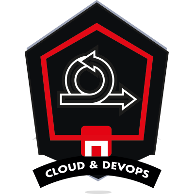
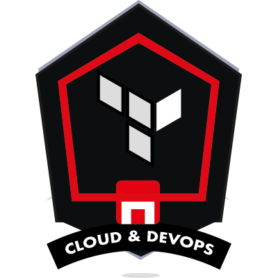
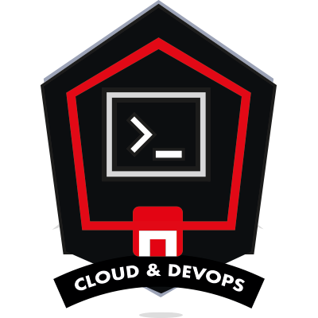

## 👋 Hola, soy Antonio!

Recién graduado como Cloud Engineer & DevOps. Apasionado por transformar ideas en soluciones eficientes y escalables, mi enfoque se centra en automatizar procesos, optimizar infraestructuras e implementar aplicaciones robustas. Creo en el poder del aprendizaje continuo y siempre estoy explorando nuevas tecnologías para mantenerme a la vanguardia del paisaje tecnológico en constante evolución.

Tengo experiencia en plataformas en la nube como AWS, Azure y GCP, y estoy familiarizado con herramientas como Docker y Kubernetes para la orquestación de contenedores. Disfruto enfrentando desafíos de frente y encontrando soluciones a problemas complejos.

Este espacio en GitHub es mi rincón digital, donde desarrollo y perfecciono mis habilidades como ingeniero en la nube. Me comprometo con el aprendizaje constante y la mejora continua, reflejando mi viaje en el emocionante mundo de la nube.

Mis repositorios públicos están disponibles para mostrar mi desarrollo en la industria y ayudar a posibles reclutadores a tener una mejor imagen de mi perfil como arquitecto en la nube y ingeniero DevOps. Siéntete libre de explorar, clonar y experimentar.

¡Conectemos y colaboremos! Estoy abierto a emocionantes oportunidades, discusiones sobre tendencias tecnológicas y colaboración en proyectos.

## 🛠️ Estas son las herramientas con las que trabajo:

## 📊 Estadísticas de mi GitHub:

 

## ✨ Skills

<table style="border: 0px;">
    <tr>
        <td></td>
        <td></td>
        <td></td>
        <td></td>
    </tr>
    <tr>
        <td></td>
        <td></td>
        <td></td>
        <td></td>
    </tr>
</table>

## 📚 Formación:

#### CLOUD & DEVOPS BOOTCAMP
#### [The Bridge | Digital Talent Accelerator](https://www.thebridge.tech/) (Septiembre 2023 - Febrero 2024)

---
#### DATA SCIENCE BOOTCAMP
#### [The Bridge | Digital Talent Accelerator](https://www.thebridge.tech/) (Septiembre 2022 - Febrero 2023)

---
#### PISCINA 42 MÁLAGA BOOTCAMP
#### [42 Málaga | Fundación Telefónica](https://www.42malaga.com/) (Agosto 2022- Septiembre 2022)

---
#### GRADUADO EN PUBLICIDAD Y RR.PP
#### [Universidad de Cádiz](https://campusvirtual.uca.es/) (Septiembre 2011 - Julio 2015)

---
#### TÉCNICO SUPERIOR EN DISEÑO GRÁFICO
#### [Escuela de Arte “Mateo Inurria”](http://www.escueladeartedecordoba.es/) (Septiembre 2009 - Junio 2011)

## ⚡ Contáctame

